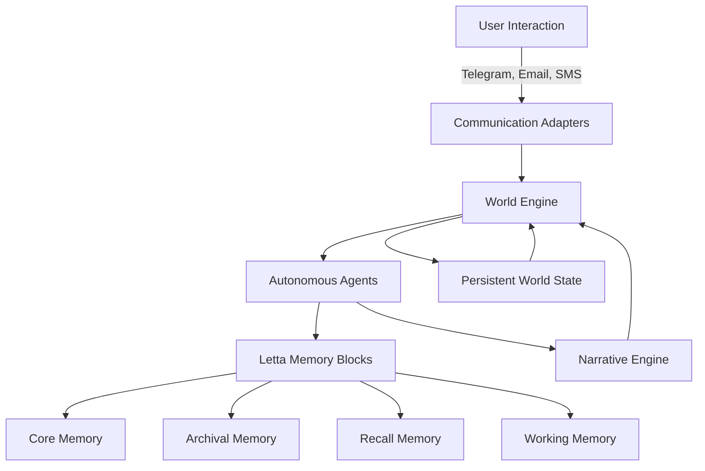

# p4n4 - Persistent Autonomous Narrative Architecture

> "Your story never ends"

## Overview

**p4n4** is a revolutionary open-source **Agentic AI Game Engine** that creates persistent, autonomous narrative experiences. Unlike traditional games that pause when you're away, p4n4 features a self-sustaining simulation where your world continues to evolve, characters develop relationships, and stories unfold—even when you're not actively playing.

Built on the powerful [Letta framework](https://github.com/letta-ai/letta) with advanced memory block architecture, p4n4 enables truly autonomous AI agents that remember, learn, and grow over time.

### Key Features

- **Persistent World**: Your game world never stops—characters continue their lives, stories progress, and events unfold in real-time
- **Letta-Powered Memory**: Advanced memory block system ensures agents retain long-term memories and evolving personalities
- **Multi-Platform Communication**: Interact seamlessly via Telegram, Email, SMS, Discord, or any communication medium
- **Autonomous Characters**: AI agents with persistent memories, evolving relationships, and independent decision-making
- **Dynamic Narratives**: Stories that adapt and grow based on player choices and autonomous character interactions
- **Cross-Platform Continuity**: Your progress and relationships persist across all communication channels

## Quick Start

### Try it Now!
**Telegram**: Start chatting with your persistent world immediately!
- Search for `@p4n4_bot` on Telegram
- Send `/start` to begin your adventure
- Your story continues even when offline!

### Email Integration
- Send emails to `bot@p4n4.com`
- Receive story updates and character messages
- Reply to influence your world's direction

## Architecture

p4n4 is built on a sophisticated agentic architecture:

### Letta Integration

p4n4 leverages Letta's revolutionary memory architecture:

- **Core Memory**: Fundamental character traits and world state
- **Archival Memory**: Long-term storage of events, relationships, and experiences  
- **Recall Memory**: Context-aware retrieval of relevant past interactions
- **Working Memory**: Active processing of current interactions and decisions

## Use Cases

### Interactive Fiction

- Create branching narratives with persistent consequences
- Characters remember your choices across sessions
- Stories evolve based on real-world time passage

### Educational Adventures

- Learn languages through persistent character relationships
- Historical simulations that continue between lessons
- Science experiments with evolving virtual lab partners

### Social Simulation

- Build lasting relationships with AI characters
- Navigate complex social dynamics that persist over time
- Watch your reputation and influence grow organically

### Training & Roleplay

- Business simulation with evolving market conditions
- Negotiation training with persistent AI counterparts
- Leadership scenarios with long-term consequences

## Installation & Development

TODO

## Documentation

### Core Concepts

- **Agents**: AI characters with persistent memories and autonomous behavior
- **Memory Blocks**: Letta's architecture for long-term information retention
- **World State**: The persistent simulation environment that continues independently  
- **Communication Adapters**: Interfaces for different interaction mediums
- **Narrative Engine**: System for generating and managing evolving storylines

### API Reference

TODO

## Contributing

We welcome contributions to p4n4! Here's how you can help:

1. **Report Bugs**: Open an issue with detailed reproduction steps
2. **Suggest Features**: Share ideas for new communication channels or gameplay mechanics
3. **Documentation**: Help improve our documentation and examples
4. **Code Contributions**: Submit pull requests for bug fixes and new features

### Development Workflow

TODO

## License

This project is licensed under the MIT License - see the [LICENSE](LICENSE) file for details.

## Acknowledgments

- **[Letta Team](https://github.com/letta-ai/letta)** for the incredible agentic memory framework
- **Community Contributors** for testing, feedback, and feature suggestions
- **AI Research Community** for advancing the field of persistent AI agents

## Support & Community

- **Email**: support@p4n4.com
- **Discord**: TODO
