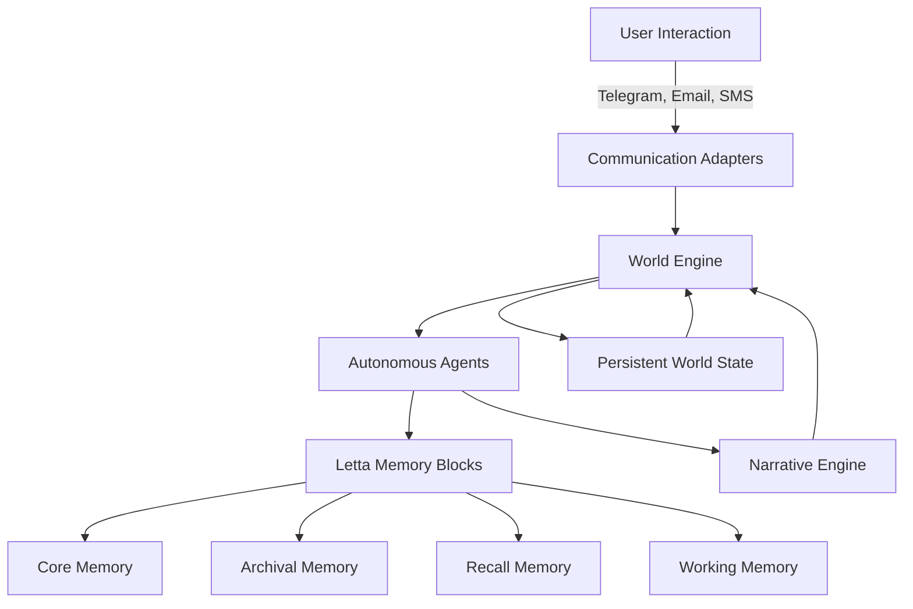

# p4n4 - Persistent Autonomous Narrative Architecture

> "Your story never ends"

[](https://opensource.org/licenses/MIT)
[](https://github.com/letta-ai/letta)

## Overview

**p4n4** is a revolutionary open-source **Agentic AI Game Engine** that creates persistent, autonomous narrative experiences. Unlike traditional games that pause when you're away, p4n4 features a self-sustaining simulation where your world continues to evolve, characters develop relationships, and stories unfold—even when you're not actively playing.

Built on the powerful [Letta framework](https://github.com/letta-ai/letta) with advanced memory block architecture, p4n4 enables truly autonomous AI agents that remember, learn, and grow over time.

### Key Features

- **Persistent World**: Your game world never stops—characters continue their lives, stories progress, and events unfold in real-time
- **Letta-Powered Memory**: Advanced memory block system ensures agents retain long-term memories and evolving personalities
- **Multi-Platform Communication**: Interact seamlessly via Telegram, Email, SMS, Discord, or any communication medium
- **Autonomous Characters**: AI agents with persistent memories, evolving relationships, and independent decision-making
- **Dynamic Narratives**: Stories that adapt and grow based on player choices and autonomous character interactions
- **Cross-Platform Continuity**: Your progress and relationships persist across all communication channels

## Quick Start

### Try it Now!
**Telegram**: Start chatting with your persistent world immediately!
- Search for `@p4n4_bot` on Telegram
- Send `/start` to begin your adventure
- Your story continues even when offline!

### Email Integration
- Send emails to `bot@p4n4.com`
- Receive story updates and character messages
- Reply to influence your world's direction

## Architecture

p4n4 is built on a sophisticated agentic architecture:



### Letta Integration

p4n4 leverages Letta's revolutionary memory architecture:

- **Core Memory**: Fundamental character traits and world state
- **Archival Memory**: Long-term storage of events, relationships, and experiences  
- **Recall Memory**: Context-aware retrieval of relevant past interactions
- **Working Memory**: Active processing of current interactions and decisions

## Use Cases

p4n4's agentic architecture enables countless possibilities for persistent, evolving experiences. Here are some compelling examples:

### Floridamen: Post-Apocalyptic Survival

Imagine Florida gets hit by an eternal storm. The land becomes desolate and mysterious after several years. In seek of adventures, people start venturing into the Stormlands. Those fortunate enough to return alive tell tales about mysterious tribes who call themselves… The Floridamen.

**What makes this unique in p4n4:**
- **Persistent Evolution**: The Floridamen tribes develop their own culture, language, and traditions over real-world months
- **Survival Mechanics**: Resources become scarce, forcing players and AI agents to make difficult choices that echo through time
- **Dynamic Relationships**: Trust between survivors builds slowly through consistent actions across multiple interactions
- **Environmental Storytelling**: The storm's effects on the landscape change based on community decisions made weeks ago

*Example Interaction:*
```
Telegram (Day 1): "You meet Zeke, a weathered Floridaman who eyes you suspiciously..."
Email (Day 5): "Zeke sends word through a messenger bird - the tribe has voted you worthy of learning their sacred storm-calling ritual"
Telegram (Day 10): "The ritual you learned from Zeke saved another settlement. Your reputation as a Storm-Walker spreads..."
```

### Living Language Academy

An immersive language learning experience where you're a foreign exchange student in a persistent virtual city. AI characters remember your progress, adjust their speech complexity, and develop personal relationships with you.

**Persistent Features:**
- **Memory-Based Progression**: Characters remember your vocabulary level and gradually introduce new concepts
- **Cultural Integration**: NPCs invite you to events based on your interests and past interactions  
- **Real-Time Events**: Miss a virtual festival because you were offline? Characters will tell you about what happened
- **Relationship Building**: Your landlord becomes more friendly as you improve, offering cultural insights and local tips

*Example Journey:*
```
Week 1: Maria the baker speaks slowly, using simple words
Week 4: Maria starts telling you local gossip, testing your comprehension
Week 8: Maria invites you to her daughter's wedding, introducing complex family terminology
Week 12: You're giving a speech at Maria's nephew's graduation - full circle fluency
```

### Corporate Negotiation Simulator

A persistent business world where you're climbing the corporate ladder. AI executives, colleagues, and competitors remember every deal, favor, and betrayal.

**Agentic Advantages:**
- **Reputation Systems**: Your past negotiations affect future opportunities across the entire company network
- **Political Intrigue**: Office politics evolve based on relationships you've built with different departments
- **Market Evolution**: Economic conditions change based on collective player decisions over time
- **Career Consequences**: A favor you did for someone in accounting six months ago might save a crucial deal today

*Example Scenario:*
```
Email: "Hi, remember when you helped me with the Peterson account last year? I'm now VP of Sales and have a proposition..."
Meeting: That small favor has opened doors to a major client you never could have reached otherwise
Result: Your persistent relationship-building strategy pays dividends in unexpected ways
```

## Installation & Development

TODO

## Documentation

### Core Concepts

- **Agents**: AI characters with persistent memories and autonomous behavior
- **Memory Blocks**: Letta's architecture for long-term information retention
- **World State**: The persistent simulation environment that continues independently  
- **Communication Adapters**: Interfaces for different interaction mediums
- **Narrative Engine**: System for generating and managing evolving storylines

### API Reference

TODO

## Contributing

We welcome contributions to p4n4! Here's how you can help:

1. **Report Bugs**: Open an issue with detailed reproduction steps
2. **Suggest Features**: Share ideas for new communication channels or gameplay mechanics
3. **Documentation**: Help improve our documentation and examples
4. **Code Contributions**: Submit pull requests for bug fixes and new features

### Development Workflow

TODO

## License

This project is licensed under the MIT License - see the [LICENSE](LICENSE) file for details.

## Acknowledgments

- **[Letta Team](https://github.com/letta-ai/letta)** for the incredible agentic memory framework
- **Community Contributors** for testing, feedback, and feature suggestions
- **AI Research Community** for advancing the field of persistent AI agents

## Support & Community

- **Email**: support@p4n4.com
- **Discord**: TODO
