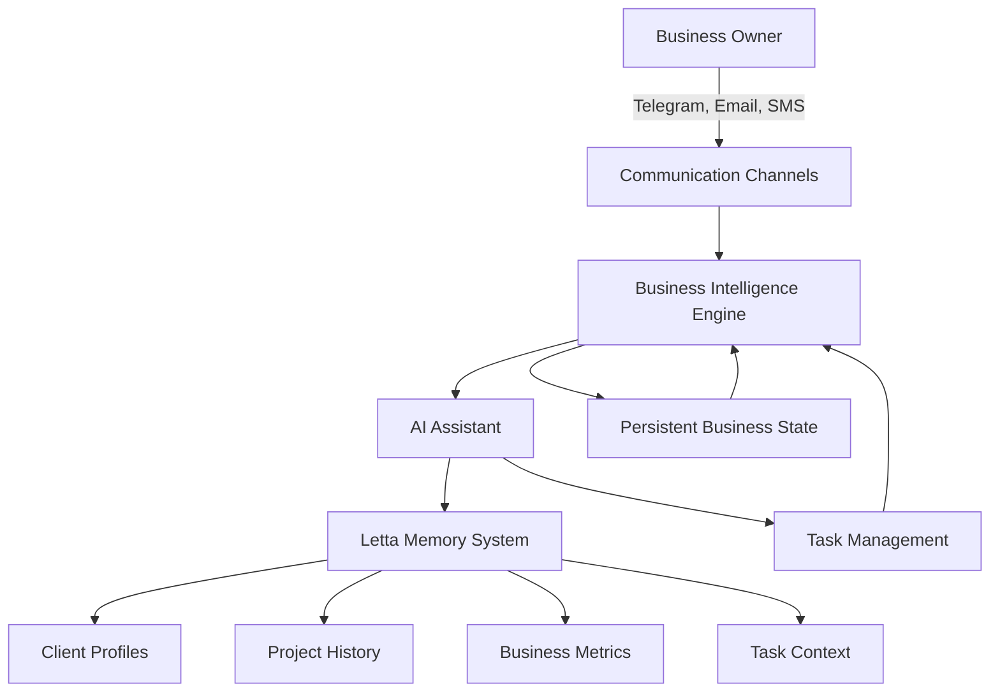

# p4n4 - Persistent AI Network Automation

> " For Single-Member LLCs"

[](https://opensource.org/licenses/MIT)
[](https://github.com/letta-ai/letta)

## Overview

**p4n4** is an intelligent AI assistant specifically designed for single-member LLC owners who wear multiple hats. Built on the powerful [Letta framework](https://github.com/letta-ai/letta), p4n4 provides persistent memory and autonomous task management to help you stay on top of your business operations across client communication, project management, administrative tasks, and strategic planning.

Unlike generic AI assistants that forget context between sessions, p4n4 maintains a continuous understanding of your business, clients, projects, and goals—learning and adapting to your unique workflow over time.

### Key Features

- **Persistent Business Memory**: Your assistant remembers all client details, project histories, deadlines, and business decisions across sessions
- **Multi-Channel Communication**: Interact seamlessly via Telegram, Email, SMS, Discord—wherever you work
- **Proactive Task Management**: Get reminders about deadlines, follow-ups, and important business milestones without asking
- **Client Relationship Tracking**: Maintain detailed context on every client interaction, preference, and project requirement
- **Autonomous Administrative Support**: Handle routine tasks like expense tracking, invoice reminders, and document organization
- **Strategic Business Intelligence**: Receive insights on business patterns, revenue trends, and growth opportunities

## Quick Start

### Try it Now!
**Telegram**: Connect with your business assistant immediately!
- Search for `@p4n4_bot` on Telegram
- Send `/start` to set up your business profile
- Your assistant learns and works for you 24/7!

### Email Integration
- Forward emails to `bot@p4n4.com`
- Get summaries, action items, and smart responses
- Your assistant tracks all communications automatically

## Architecture

p4n4 is built on sophisticated agentic AI architecture optimized for business operations:



### Letta Integration

p4n4 leverages Letta's advanced memory architecture for business continuity:

- **Core Memory**: Your business fundamentals, key clients, and operational preferences
- **Archival Memory**: Complete history of projects, decisions, and client interactions
- **Recall Memory**: Context-aware retrieval of relevant past conversations and commitments
- **Working Memory**: Active tracking of ongoing projects, deadlines, and priorities

## Use Cases

p4n4's persistent memory system enables powerful business automation for single-member LLCs:

### Freelance Software Developer

You're juggling multiple client projects with different tech stacks, deadlines, and communication preferences.

**How p4n4 Helps:**
- **Client Context Switching**: "Tell me where I left off with the Johnson account" - instant recall of last discussion, pending features, and technical decisions
- **Project Timeline Tracking**: Proactive reminders about milestone deadlines across all active projects
- **Technical Documentation**: "What database solution did I recommend to the Martinez project?" - instant recall from conversations weeks ago
- **Proposal Automation**: Generate accurate project estimates based on historical time tracking and similar past projects

*Example Workflow:*
```
Morning Email: "You have two client calls today. Johnson (React migration) wants an update on the authentication module. Martinez (API project) likely to ask about the timeline extension you discussed last week."

Telegram (3 PM): "Reminder: Send invoice to Chen Corp - project delivered 2 weeks ago, payment terms are Net-30"

Email (Evening): "Johnson mentioned performance concerns in today's call. Based on your previous optimization work for similar projects, here's a technical approach you could propose..."
```

### Independent Consultant

You're advising multiple businesses on strategy, with each client requiring customized insights and careful relationship management.

**How p4n4 Helps:**
- **Client Intelligence**: "What are the top 3 concerns for Acme Corp right now?" - aggregates insights from all interactions
- **Meeting Preparation**: Automatic briefings before calls with conversation history, pending deliverables, and suggested talking points
- **Follow-up Management**: Never miss a follow-up commitment; your assistant tracks every "I'll send you..." promise
- **Knowledge Base**: "Which clients have I worked with in the retail sector?" - instant access to your entire business network

*Example Scenario:*
```
Pre-Meeting Brief: "Call with Acme Corp in 30 minutes. Last discussion: Q3 growth strategy. They're concerned about customer retention (mentioned 3x in last meeting). You promised to send competitor analysis by EOW."

Post-Meeting: "Detected 4 action items from your call. Added to task list with deadlines. Draft email to Acme summarizing next steps?"

Week Later: "Acme mentioned budget concerns during your last call. Might affect your proposal for Phase 2. Consider flexible payment terms?"
```

### Creative Agency Owner

You're managing client brands, creative projects, revision cycles, and deliverable schedules across multiple industries.

**How p4n4 Helps:**
- **Brand Guidelines Memory**: Instantly recall each client's brand voice, color schemes, style preferences, and approval processes
- **Revision Tracking**: "How many revision rounds are we on for the Nike campaign?" - complete project history at your fingertips
- **Asset Management**: "Where did I save the approved logo files for Johnson Industries?" - organizational memory that never forgets
- **Client Preferences**: Remembers that Client A prefers Slack for quick feedback while Client B only uses email

*Example Journey:*
```
Client Message: "Can we see what we did for last year's holiday campaign?"
p4n4: "Retrieved: Holiday 2024 campaign (3 concepts, Client approved Option B with green background). Files at Drive/Clients/BrandX/2024-Holiday/"

Later: "BrandX just emailed requesting 'something similar to that spring campaign.' Based on your archives, sending you Spring 2024 concepts and performance metrics..."

Next Week: "Reminder: BrandX typically requests Q4 planning in early September. Might want to reach out proactively with ideas."
```

## Benefits for Single-Member LLCs

### Never Lose Business Context
Traditional assistants forget. p4n4 remembers every client preference, project detail, and business commitment—creating institutional memory for a one-person operation.

### Scale Without Hiring
Handle more clients and projects without the overhead of employees. Your AI assistant provides continuity and organization that typically requires a team.

### Professional Client Experience
Deliver the responsiveness and attention to detail of a large firm while maintaining the flexibility and personal touch of a solo practice.

### Work-Life Balance
Your assistant handles routine follow-ups, deadline tracking, and administrative tasks—freeing you to focus on billable work and strategic growth.

## Installation & Development

### Prerequisites
```bash
# Python 3.9+
# Letta framework
pip install letta
```

### Quick Setup
```bash
# Clone repository
git clone https://github.com/yourusername/p4n4.git
cd p4n4

# Install dependencies
pip install -r requirements.txt

# Configure your business profile
python setup.py --profile business

# Start your assistant
python main.py
```

Detailed installation guide: [INSTALLATION.md](INSTALLATION.md)

## Documentation

### Core Concepts

- **Business Profile**: Your LLC details, services, and operational preferences
- **Client Memory**: Persistent records of all client relationships and interactions
- **Project Tracking**: Automatic monitoring of timelines, deliverables, and milestones
- **Communication Adapters**: Multi-channel interfaces (Email, Telegram, SMS, Slack, Discord)
- **Task Intelligence**: Proactive identification and management of business actions

### API Reference

Coming soon - REST API for custom integrations with your existing tools.

## Security & Privacy

Your business data is sensitive. p4n4 is designed with privacy first:

- **Local-First Architecture**: All data stored on your infrastructure by default
- **Encrypted Communications**: End-to-end encryption for all channels
- **Client Confidentiality**: Isolation between client data and projects
- **GDPR Compliant**: Built-in data retention and deletion policies
- **No Third-Party Sharing**: Your business intelligence stays with you

## Contributing

We welcome contributions from fellow single-member LLC owners and developers:

1. **Report Issues**: Share bugs or feature requests relevant to business operations
2. **Suggest Features**: What would make your solo business more efficient?
3. **Documentation**: Help improve setup guides and use cases
4. **Code Contributions**: Submit pull requests for improvements

## License

This project is licensed under the MIT License - see the [LICENSE](LICENSE) file for details.

## Acknowledgments

- **[Letta Team](https://github.com/letta-ai/letta)** for the powerful agentic memory framework
- **Solo Business Owners** who provided feedback and feature suggestions
- **Open Source Community** for advancing AI-assisted productivity

## Support & Community

- **Email**: support@p4n4.com
- **Documentation**: [docs.p4n4.com](https://docs.p4n4.com)
